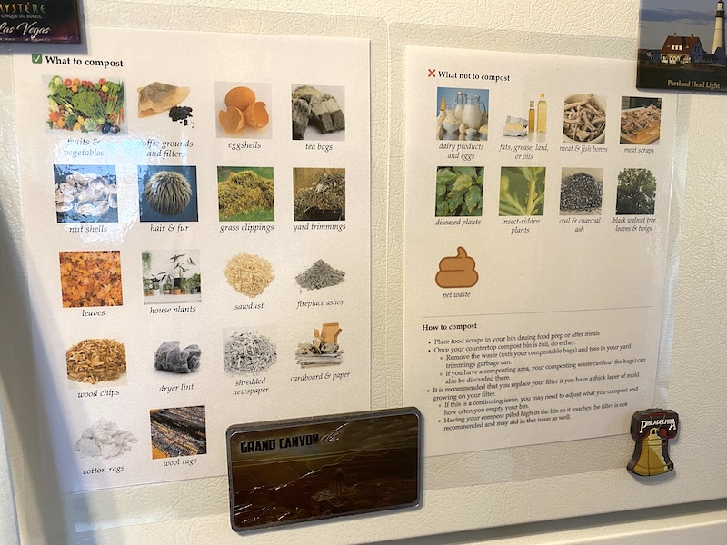

```{r setup, include=FALSE}
knitr::opts_chunk$set(echo = FALSE, message = FALSE)
```

The [R Markdown](https://rmarkdown.rstudio.com/) document [compost.Rmd](compost.Rmd) together with [styles.css](styles.css) produces an HTML page like:


...which can be saved to a PDF, printed, and laminated:



## Images

The document generated by a page based on files in the `images/compostable` and `images/not compostable` directories which looked like:

```{r directory}
directory <- data.frame(
  pathString = fs::dir_ls("images", recurse = TRUE),
  stringsAsFactors = FALSE
)
```
```{r tree}
library(data.tree) # install.packages("data.tree")
library(magrittr)

tree <- as.Node(directory)
ToDataFrameTree(tree)$levelName %>%
  paste0(collapse = "\n") %>%
  cat
```
