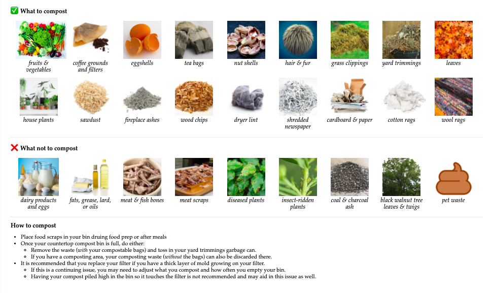

Compostables
================

The [R Markdown](https://rmarkdown.rstudio.com/) document
[compost.Rmd](compost.Rmd) together with [styles.css](styles.css)
produces an HTML page like:

…which can be saved to a PDF, printed, and laminated:

## Images

The document generated by a page based on files in the
`images/compostable` and `images/not compostable` directories which
looked like:

    ## images                                           
    ##  ¦--compostable                                  
    ##  ¦   ¦--01 - fruits & vegetables.jpg             
    ##  ¦   ¦--02 - coffee grounds and filters.jpg      
    ##  ¦   ¦--03 - eggshells.jpg                       
    ##  ¦   ¦--04 - tea bags.jpg                        
    ##  ¦   ¦--05 - nut shells.jpg                      
    ##  ¦   ¦--06 - hair & fur.png                      
    ##  ¦   ¦--07 - grass clippings.jpg                 
    ##  ¦   ¦--08 - yard trimmings.png                  
    ##  ¦   ¦--09 - leaves.jpg                          
    ##  ¦   ¦--10 - house plants.jpg                    
    ##  ¦   ¦--11 - sawdust.jpg                         
    ##  ¦   ¦--12 - fireplace ashes.jpg                 
    ##  ¦   ¦--13 - wood chips.jpg                      
    ##  ¦   ¦--14 - dryer lint.jpg                      
    ##  ¦   ¦--15 - shredded newspaper.jpg              
    ##  ¦   ¦--16 - cardboard & paper.png               
    ##  ¦   ¦--17 - cotton rags.jpg                     
    ##  ¦   °--18 - wool rags.jpg                       
    ##  °--not compostable                              
    ##      ¦--01 - dairy products and eggs.jpg         
    ##      ¦--02 - fats, grease, lard, or oils.jpg     
    ##      ¦--03 - meat & fish bones.jpg               
    ##      ¦--04 - meat scraps.jpg                     
    ##      ¦--05 - diseased plants.jpg                 
    ##      ¦--06 - insect-ridden plants.jpg            
    ##      ¦--07 - coal & charcoal ash.jpg             
    ##      ¦--08 - black walnut tree leaves & twigs.jpg
    ##      °--09 - pet waste.png
